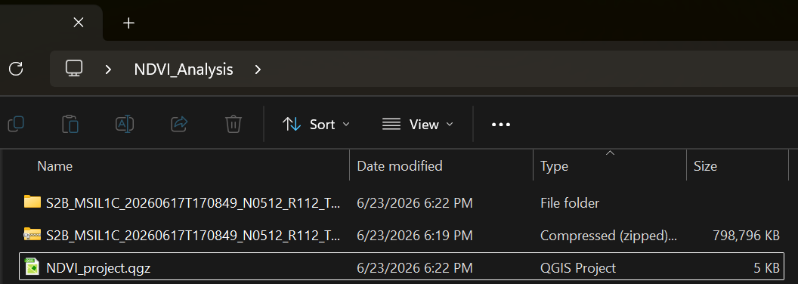
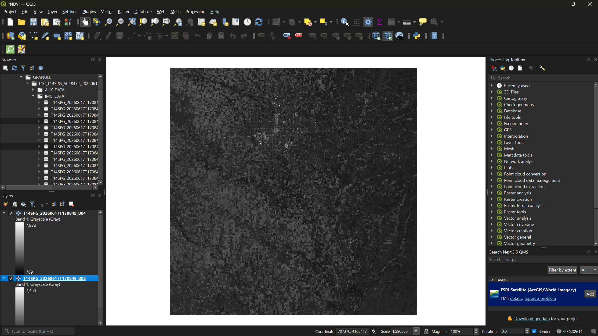
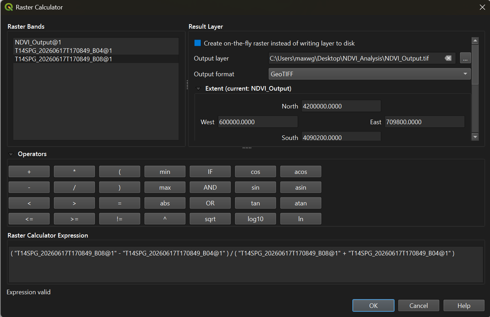
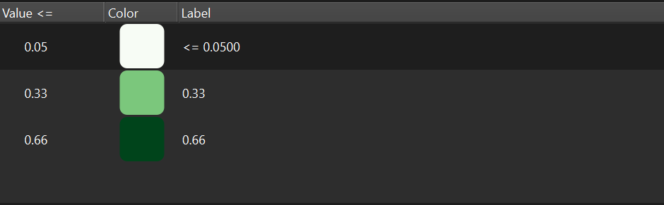
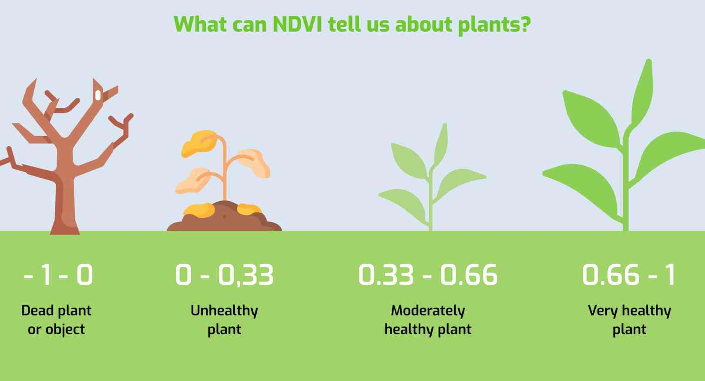
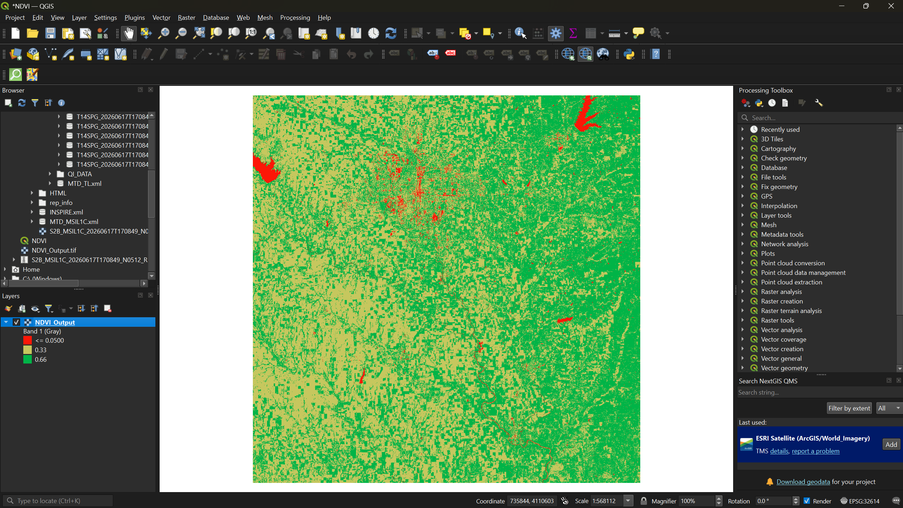
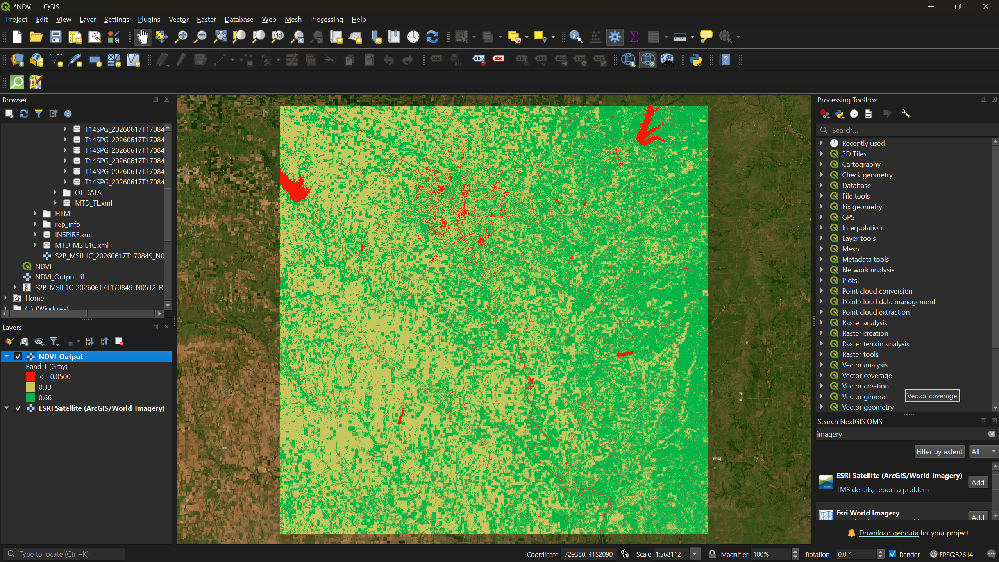

:::::::::::::::::::::::::::::::::::::: questions

- What is NDVI and what does it measure?
- How do I calculate NDVI from Sentinel-2 bands in QGIS?
- How do I interpret and visualize NDVI results?

::::::::::::::::::::::::::::::::::::::::::::::::

::::::::::::::::::::::::::::::::::::: objectives

- Understand what NDVI measures and why it is useful
- Load individual Sentinel-2 spectral bands into QGIS
- Use the Raster Calculator to compute NDVI from red and near-infrared bands
- Apply pseudocolor symbology to interpret vegetation health
- Compare NDVI results against satellite basemap imagery

::::::::::::::::::::::::::::::::::::::::::::::::

## Introduction

A **Normalized Difference Vegetation Index (NDVI)** is a widely used landscape metric that quantifies the health and density of vegetation using satellite sensor data. It works by comparing the reflectance of red light (which vegetation absorbs) and near-infrared light (which healthy vegetation strongly reflects). The formula is:

**NDVI = (NIR − Red) / (NIR + Red)**

NDVI values range from −1 to +1. Values near +1 indicate dense, healthy vegetation; values near 0 indicate bare soil or sparse cover; and negative values typically indicate water, clouds, or snow.


In this exercise we will use a Sentinel-2 multispectral image to calculate NDVI for a region in south-central Kansas.

::::::::::::::::::::::::::::::::::::: callout

### ESRI Sentinel 2 Atlas

Take a moment to explore Sentinel-2 Land Cover [Living Atlas](https://livingatlas.arcgis.com/landcoverexplorer/#mapCenter=-86.23422%2C39.81847%2C12.56&mode=step&timeExtent=2017%2C2025&year=2025&showImageryLayer=true&renderingRule=0&month=9). Take a note of its features!

Esri’s Sentinel-2 platform in the ArcGIS Living Atlas is a free, web-based tool that provides dynamic access to global, multi-spectral satellite imagery. It features a rolling 14-month archive of the best, most cloud-free scenes, which update daily at a 10-meter spatial resolution. 

::::::::::::::::::::::::::::::::::::::::::::::::

---

## Step 1: Set Up Your Project

1. Create a folder on your desktop called **NDVI_Analysis** (if you have not already done so from the setup page).
2. Open QGIS, close any pop-ups, and go to **Project → Save As**. Save the project as `NDVI_Project` inside your NDVI_Analysis folder.

---

## Step 2: Download and Extract the Sentinel-2 Image

1. Navigate to the workshop's shared resources Google Drive. Under **Day 1_Session 3a: Basic raster functions**, download the ZIP file:
   `S2B_MSIL1C_20260617T170849_N0512_R112_T14SPG_20260617T203803.SAFE.zip`

2. Save the ZIP file to your **NDVI_Analysis** folder and extract it:
   - **Windows:** Right-click → **Extract All**
   - **Mac:** Double-click the ZIP file



---

## Step 3: Load the Red and NIR Bands

Sentinel-2 images contain 13 spectral bands stored as individual files. For NDVI we only need two:

- **Band 4** (Red) — `T14SPG_20260617T170849_B04.jp2`
- **Band 8** (Near-Infrared) — `T14SPG_20260617T170849_B08.jp2`

To find them:

1. In the **Browser Panel** on the left side of QGIS, navigate to:
   **Project Home → S2B_MSIL1C_…SAFE → GRANULE → L1C_T14SPG_… → IMG_DATA**
2. Drag **B04** and **B08** into the **Layers Panel**.



Toggle each layer's visibility using the checkbox next to its name to see how the two bands differ — Band 4 captures visible red light, while Band 8 captures near-infrared reflectance that is invisible to the human eye but strongly reflected by healthy vegetation.

---

## Step 4: Calculate NDVI with the Raster Calculator

1. From the menu bar, select **Raster → Raster Calculator**.
2. In the expression box, enter the NDVI formula. You can double-click the band names in the **Raster Bands** list to insert them:

```
( "T14SPG_20260617T170849_B08@1" - "T14SPG_20260617T170849_B04@1" ) / ( "T14SPG_20260617T170849_B08@1" + "T14SPG_20260617T170849_B04@1" )
```



3. Click the three-dot button next to **Output layer** and save it as `NDVI_Output` in your NDVI_Analysis folder.
4. Click **OK** to run the calculation.

Once the output loads, you can right-click Bands 4 and 8 in the Layers Panel and select **Remove Layer** — they are no longer needed.

---

## Step 5: Apply Color Symbology

The raw NDVI output appears in grayscale. To make vegetation patterns visible, we need to apply a color ramp.

1. Right-click the `NDVI_Output` layer → **Properties** → **Symbology** tab.
2. Change the **Render type** to **Singleband pseudocolor**.
3. Set **Interpolation** to **Discrete**.
4. Set the **Color ramp** to **Greens**.
5. Under the table, set the **Mode** to **Equal Interval** and reduce the **Classes** to **3**.
6. In the **Value** column, enter the following from bottom to top: `0.66`, `0.33`, `0.05`.
7. Click **Apply**.



---

## Step 6: Refine the Color Scheme

The green-only ramp shows the classification, but we can make interpretation more intuitive by matching colors to vegetation health levels.



Using the reference scale above as a guide:

1. Reopen the **Symbology** tab.
2. Double-click each color swatch to change it:
   - **Bottom class (0.05–0.33)** → **Red** — inanimate objects, bare soil, or dead vegetation
   - **Middle class (0.33–0.66)** → **Yellow** — unhealthy or sparse vegetation
   - **Top class (0.66–1.0)** → **Green** — dense, healthy vegetation
3. Click **Apply**, then **OK**.



:::::::::::::::::::::::::::::::::::: challenge

### Exercise 1: Interpret the NDVI Map

Look at your NDVI output and try to answer the following:

1. Can you identify Wichita (the largest city in the region)? What NDVI values dominate urban areas?
2. Can you locate any lakes or rivers? What values do they show?
3. Where is the densest vegetation — is it farmland, forest, or something else?

Write down your initial observations. We will check them against satellite imagery in the next step.

::::::::::::::::::::::::::::::::::::::::::::::::

---

## Step 7: Add a Basemap for Comparison

To verify your interpretations, add a satellite basemap underneath the NDVI layer.

1. From the menu bar, select **Plugins → Manage and Install Plugins**.
2. Search for **QuickMapServices** and click **Install Plugin** (if not already installed from Session 1a).
3. After installation, a **QMS** panel should appear on the right side of your screen. Search for `imagery` and add **Esri Satellite (ArcGIS/World_Imagery)** to your map.

Now toggle the NDVI layer on and off in the Layers Panel to compare your NDVI classification against the actual satellite imagery.



:::::::::::::::::::::::::::::::::::: challenge

### Exercise 2: Verify Your Observations

Compare your NDVI results against the satellite basemap.

1. Were your initial observations from Exercise 1 correct?
2. Did anything surprise you — areas you expected to be vegetated that were not, or vice versa?
3. Can you identify any agricultural fields? How do their NDVI values differ from surrounding natural vegetation?

::::::::::::::::::::::::::::::::::::::::::::::::

---

::::::::::::::::::::::::::::::::::::: keypoints

- NDVI uses the ratio of near-infrared and red reflectance to quantify vegetation health and density.
- Sentinel-2 Bands 4 (Red) and 8 (NIR) are the inputs for NDVI calculation in QGIS.
- Refer to this Multispectral Band Combinations website [here](https://gisgeography.com/sentinel-2-bands-combinations/) to learn what the function of each combination is!
- The Raster Calculator applies the NDVI formula on a per-pixel basis across the entire image.
- Thoughtful color symbology (red → yellow → green) makes NDVI results immediately interpretable.
- Comparing NDVI output against a satellite basemap helps validate your interpretation of the results.

::::::::::::::::::::::::::::::::::::::::::::::::
